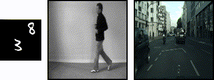
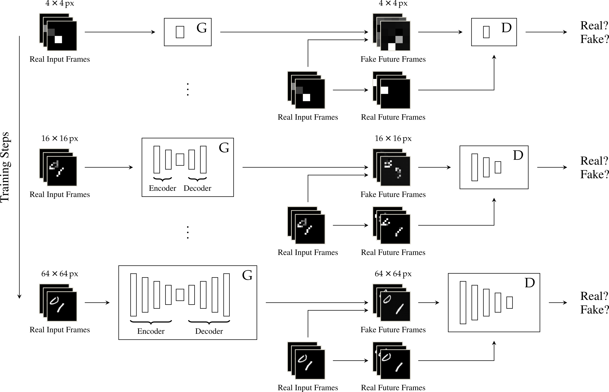
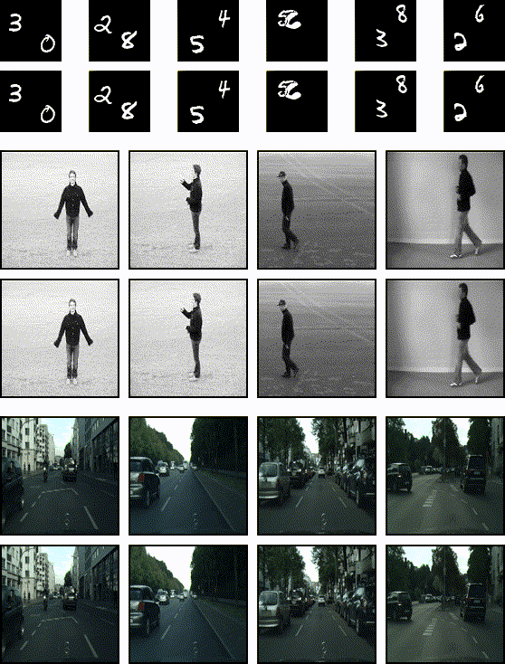

# FutureGAN - *Official PyTorch Implementation*
This is the official PyTorch implementation of FutureGAN. The code accompanies the paper ["FutureGAN: Anticipating the Future Frames of Video Sequences using Spatio-Temporal 3d Convolutions in Progressively Growing GANs"](https://arxiv.org/abs/1810.01325).

  
   
  Predictions generated by our FutureGAN (red) conditioned on input frames (black).

## Overview
__Abstract__ 
*We introduce a new encoder-decoder GAN model, FutureGAN, that predicts future frames of a video sequence conditioned on a sequence of past frames. During training, the networks solely receive the raw pixel values as an input, without relying on additional constraints or dataset specific conditions. To capture both the spatial and temporal components of a video sequence, spatio-temporal 3d convolutions are used in all encoder and decoder modules. Further, we utilize concepts of the existing progressively growing GAN (PGGAN) that achieves high-quality results on generating high-resolution single images. The FutureGAN model extends this concept to the complex task of video prediction. We conducted experiments on three different datasets, MovingMNIST, KTH Action, and Cityscapes. Our results show that the model learned representations to transform the information of an input sequence into a plausible future sequence effectively for all three datasets. The main advantage of the FutureGAN framework is that it is applicable to various different datasets without additional changes, whilst achieving stable results that are competitive to the state-of-the-art in video prediction.*

__Framework__ 

  
    
  We initialize both networks to take a set of 4 × 4 px resolution frames and output frames of the same resolution.
  During training, layers are added progressively for each resolution step. The resolution of the input frames matches the resolution of the current state of the networks.

## Code Usage
__Requirements__ 

Firts make sure to have CUDA9.0 + CUDNN7 installed. 
Then, install Anaconda3 and create and activate the FutureGAN-conda environment:

~~~
$ conda env create -f FutureGAN_env.yml
$ source activate FutureGAN
~~~

__Datasets__ 

FutureGAN accepts '.jpg', '.jpeg', '.png', '.ppm', '.bmp', and '.pgm' files.
To train the networks on MovingMNIST or KTH Action, you can use our scripts in the 'data'-folder to set up the datasets.
If you want to train FutureGAN on other datasets, just make sure your train and test data folders are arranged in this way:
~~~
----------------------------------------
<data_root>
          |--video1
                  |--frame1
                  |--frame2
                  |--frame3 ...
          |--video2 ...
----------------------------------------
~~~

__Train the Network__ 

To train the networks with default settings, use the `--data_root` flag to specify the path to your training data and simply run:
~~~~
$ python train.py --data_root='<path/to/trainsplit/of/your/dataset>'
~~~~

If you want to display the training progress on Tensorboard, set the `--tb_logging` flag:
~~~~
$ python train.py --data_root='<path/to/trainsplit/of/your/dataset>' --tb_logging=True
~~~~

To resume training from a checkpoint, set `--use_ckpt=True` and specify the paths to the generator `ckpt_path[0]` and discriminator `ckpt_path[1]` like this:
~~~~
$ python train.py --data_root='<path/to/trainsplit/of/your/dataset>' --use_ckpt=True --ckpt_path='<path_to_generator_ckpt>' --ckpt_path='<path_to_discriminator_ckpt>'
~~~~

For further options and information, please read the help description and comments in the code.

__Test and Evaluate the Network__ 
To generate predictions with a trained FutureGAN, use the `--data_root` and `--model_path` flags to specify the path to your test data and generator weights and run:
~~~~
$ python eval.py --data_root='<path/to/testsplit/of/your/dataset>' --model_path='<path_to_generator_ckpt>'
~~~~

For evaluation you can choose which metrics are calculated, please set the `--metrics` flag accordingly.
Your choices are `mse`, `psnr`, `ssim`, `ssim2`, and `ms_ssim`.
If you want to calculate multiple metrics, simply append them using the `--metrics` flag, *e.g.*:
~~~~
$ python eval.py --data_root='<path/to/testsplit/of/your/dataset>' --model_path='<path_to_generator_ckpt>' --metrics='mse' --metrics='psnr'
~~~~

For further options and information, please read the help description and comments in the code.

We trained our FutureGAN on three different datasets, *i.e.* [MovingMNIST](https://github.com/emansim/unsupervised-videos) (64×64 px), [KTH Action](http://www.nada.kth.se/cvap/actions/) (bicubically resized to 128×128 px), and [Cityscapes](https://www.cityscapes-dataset.com/) (bicubically resized to 128×128 px).
For MovingMNIST and KTH Action the networks were trained to predict 6 frames conditioned on 6 input frames.
For Cityscapes they were trained to predict 5 frames based on 5 input frames.
<b>All pre-trained models are available upon request, please contact sandra.aigner@tum.de.</b>

## FutureGAN Examples
__Predictions (MovingMNIST and KTH Action: 6 Frames, Cityscapes: 5 Frames)__ 
The top row of each dataset displays the input frames (black) and the predictions of FutureGAN (red).
The bottom rows show the input frames (black) and the ground truth frames (red).

  

__Long-Term Predictions (KTH Action: 120 Frames, Cityscapes: 25 Frames)__ 
The top row displays the input frames (black) and the predictions of FutureGAN (red).
To generate the long-term predictions, we recursively fed the predicted frames back in as input.
The bottom row shows the input frames (black) and the ground truth frames (red).

  

## Acknowledgements
This code borrows from
+ [nashory/progressive-growing-torch](https://github.com/nashory/progressive-growing-torch)
+ [tkarras/progressive_growing_of_gans](https://github.com/tkarras/progressive_growing_of_gans)
+ [github-pengge/PyTorch-progressive_growing_of_gans](https://github.com/github-pengge/PyTorch-progressive_growing_of_gans)
